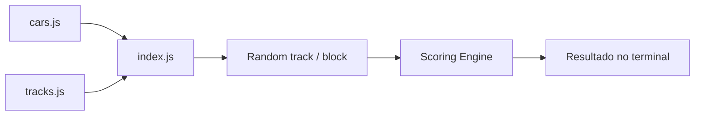

# Race Simulator

Simulador de corrida desenvolvido em JavaScript para comparar carros GT3 em diferentes trechos de pista com base em atributos como velocidade, downforce, tração e estabilidade.

## Tecnologias

- Node.js
- JavaScript
- ES Modules

O projeto não utiliza dependências externas no estado atual.

## Conceito

A simulação possui uma lista de carros GT3 e circuitos. Durante a corrida, trechos são sorteados e diferentes atributos são utilizados para definir o carro com melhor desempenho.

Exemplos de carros existentes no projeto:

- Porsche 911 GT3 R
- Mercedes-AMG GT3
- Audi R8 LMS GT3
- Ferrari 296 GT3
- Lamborghini Huracán GT3
- BMW M4 GT3

O projeto também mantém dados de circuitos como Nürburgring, Spa, Suzuka, Monza, Interlagos e outros.

## Arquitetura



## Estrutura

```text
race-simulator/
├── src/
│   ├── cars.js
│   ├── tracks.js
│   └── index.js
└── package.json
```

## Requisitos

- Node.js

## Como rodar

Clone:

```bash
git clone https://github.com/juankurtzzz/race-simulator.git
cd race-simulator
```

Como não existem dependências externas, não é necessário instalar pacotes para executar o código atual.

Execute:

```bash
node src/index.js
```

## Motor da corrida

O fluxo atual executa:

1. Carrega os carros.
2. Sorteia uma pista.
3. Executa 5 voltas.
4. Cada volta possui 6 partes.
5. Cada parte pode favorecer atributos específicos.
6. O carro vencedor do trecho recebe pontos.
7. O ranking final é exibido no terminal.

Para retas, o motor considera principalmente `velocidade`.

Para curvas, utiliza a soma de:

```text
downforce + tracao + estabilidade
```

## Classes principais

### `racingCar`

Representa um carro com:

```text
nome
velocidade
downforce
tracao
estabilidade
```

### `tracks`

Representa características da pista.

## Desenvolvimento

Atualmente o `package.json` não possui um script de inicialização. Uma melhoria simples seria adicionar:

```json
{
  "scripts": {
    "start": "node src/index.js"
  }
}
```

Então o projeto poderia ser executado com:

```bash
npm start
```

> O bloco acima é uma sugestão; o script ainda não existe no estado atual do repositório.

## Limpeza recomendada

Adicione `.idea/` ao `.gitignore` caso utilize uma IDE JetBrains.
